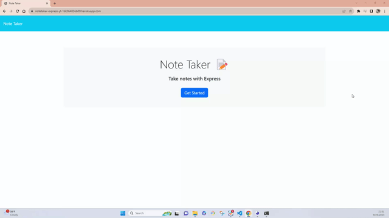

# NoteTaker-Express.js

 
  
  
   

  ## Table of Contents
  - [Description](#Description)
  - [Installation](#Installation)
  - [Usage](#Usage)
  - [Credits](#Credits)
  - [License](#License)
  - [Test](#Tests)
  - [Questions](#Questions)

  ## Description
  - An app used to take notes.
  - When opening the Note Taker, a clean page appears with a button that when clicked users are taken to another page.
  - This new page is where users can create, save and/or delete their notes.
  - The left hand side displays the saved notes and the right side has a field with title and text for notes creation.
  - An icon for saving the notes pops up in the top right when writing a note.
  - The plus sign at the top right will take users from their saved notes to create new ones.
  - Notes can be deteled by clicking the trash icon next to them.
  - The application contains a wildcar that takes users to the homepage in case the path is not correct.
  - [ Heroke deployed web ](https://notetaker-express-yf-1dc064856b09.herokuapp.com/)

  ## Installation
  - Node js
  - npm i
  - https://github.com/YemnyFeliz/NoteTaker-Express.js.git

  ## Usage
  

  ## Credits
  The starter code was provided by Xander Rapstine.

  ## License
  This project is licensed under [MIT](https://opensource.org/licenses/MIT) license

  ## Tests
  N/A

  ## Questions
  If you have any questions about this project please contact me:
  - GitHub: [@YemnyFeliz](https://github.com/YemnyFeliz)
  - Email: y.feliz1296@gmail.com
